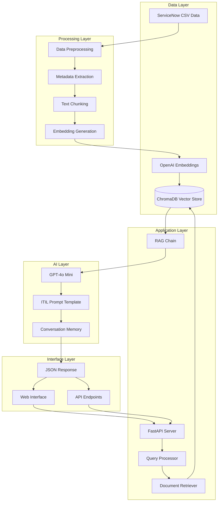
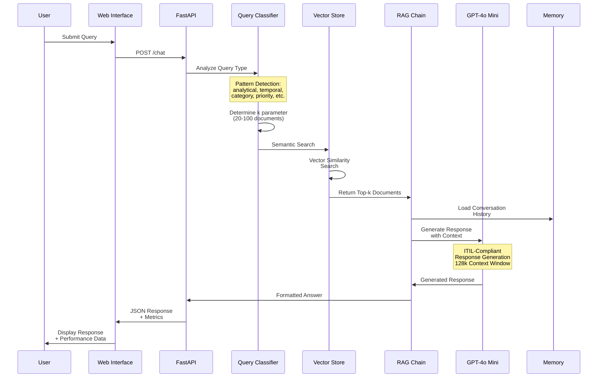
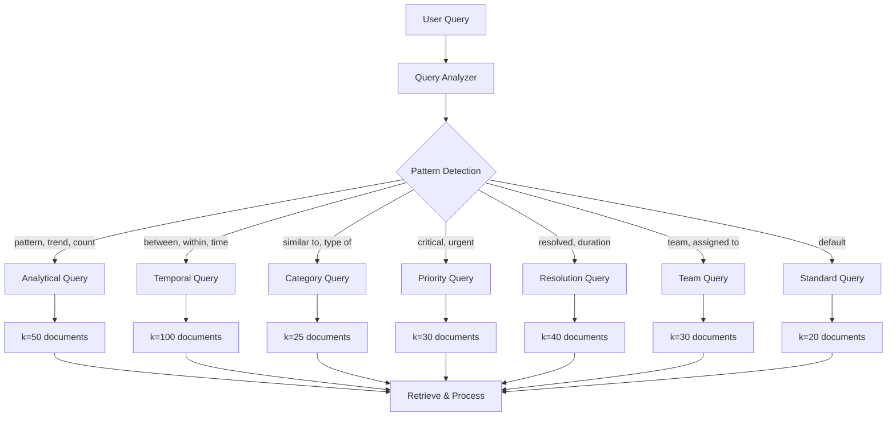
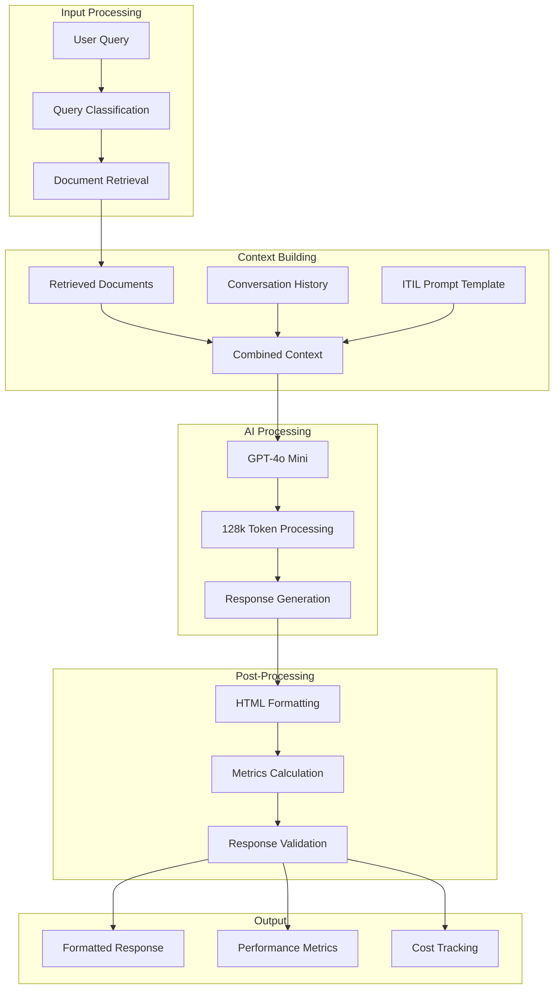
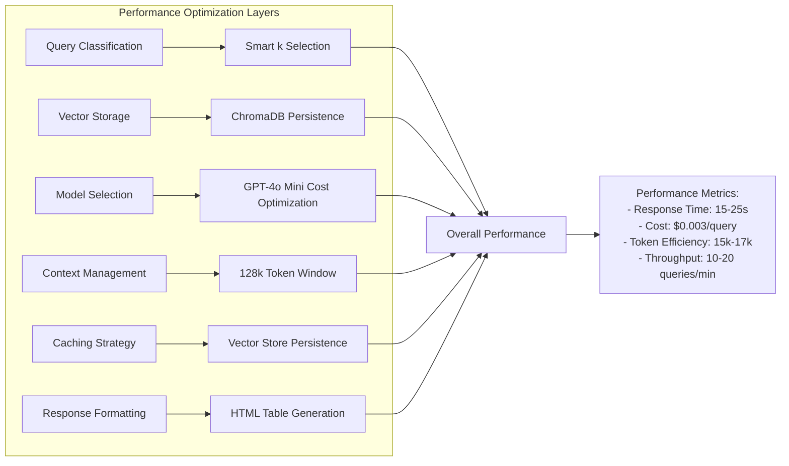
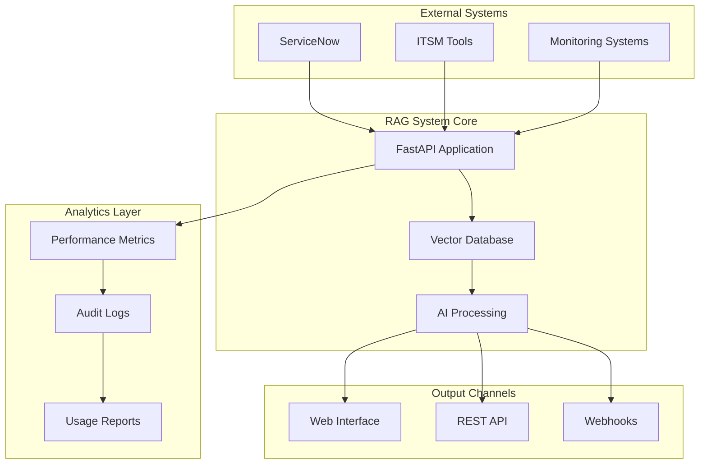

# RAG Process Flow Diagrams

This document provides detailed flow diagrams for the Enterprise RAG IT Support Assistant system.

## 1. Complete RAG Architecture Flow

## 2. Query Processing Sequence

## 3. Data Processing Pipeline

```mermaid
flowchart LR
    subgraph "Input Stage"
        A[Raw CSV Data]
        B[Incident Records]
    end
    
    subgraph "Preprocessing Stage"
        C[Data Validation]
        D[Date Parsing]
        E[Priority Mapping]
        F[Category Standardization]
    end
    
    subgraph "Enrichment Stage"
        G[Resolution Time Calculation]
        H[Severity Classification]
        I[ITIL Structure Mapping]
        J[Metadata Generation]
    end
    
    subgraph "Text Processing Stage"
        K[Structured Text Creation]
        L[Semantic Chunking]
        M[Embedding Generation]
    end
    
    subgraph "Storage Stage"
        N[Vector Storage]
        O[Metadata Indexing]
        P[Persistence Layer]
    end
    
    A --> B
    B --> C
    C --> D
    D --> E
    E --> F
    F --> G
    G --> H
    H --> I
    I --> J
    J --> K
    K --> L
    L --> M
    M --> N
    N --> O
    O --> P
```

## 4. Dynamic Query Classification System

## 5. Response Generation Flow

## 6. System Performance Optimization

## 7. Enterprise Integration Points

## Key Performance Indicators

### Response Quality Metrics
- **ITIL Compliance**: 100% structured responses
- **Accuracy**: High relevance through semantic search
- **Completeness**: Comprehensive incident analysis

### System Performance Metrics
- **Response Time**: 15-25 seconds for complex queries
- **Cost Efficiency**: $0.003 per query (98.5% savings vs GPT-4)
- **Token Utilization**: 15k-17k tokens per analytical query
- **Throughput**: 10-20 queries per minute

### Technical Metrics
- **Context Window**: 128k tokens supported
- **Vector Database**: 100k+ incidents supported
- **Embedding Dimensions**: 1536 (OpenAI text-embedding-ada-002)
- **Memory Persistence**: ChromaDB with automatic persistence

This flow documentation provides a comprehensive view of how the RAG system processes queries from initial input through final response generation, highlighting the sophisticated intelligence built into each stage of the process.
