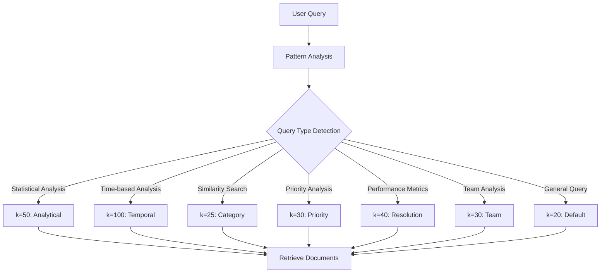
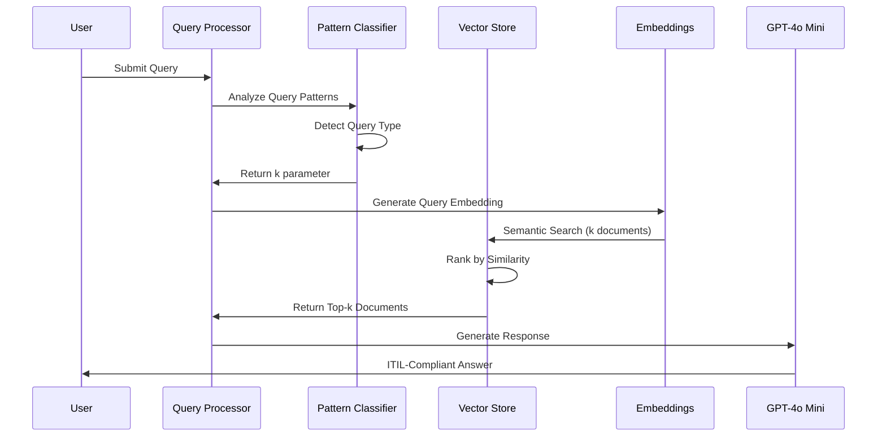

# Metadata Chunking and Query Patterns Documentation

This document provides an in-depth explanation of how metadata is structured, chunked, and queried in the Enterprise RAG IT Support Assistant system.

## 📊 Metadata Structure and Chunking Strategy

### 1. Raw Incident Data Structure

The system processes ServiceNow incident data with the following core fields:

```csv
Number, State, Category, Subcategory, Impact, Urgency, Priority, 
Opened At, Resolved At, Assignment Group, Assigned To, 
Short Description, Notes
```

### 2. Metadata Extraction and Optimization

The system transforms raw incident data into optimized metadata for efficient querying:

```python
# Original metadata extraction from app.py
meta = {
    # Primary identifiers
    'incident_id': row['Number'],                    # e.g., 'INC0012347'
    
    # Core categorization (for filtering and grouping)
    'category': row['Category'],                     # e.g., 'Hardware'
    'subcategory': row['Subcategory'],              # e.g., 'Printer'
    
    # Priority and impact (for severity-based queries)
    'priority_level': row['Priority'].split(' - ')[0],  # e.g., '2' from '2 - High'
    'severity': severity,                            # e.g., 'High', 'Medium', 'Low'
    
    # Operational status
    'state': row['State'],                          # e.g., 'Resolved', 'Open'
    'team': row['Assignment Group'],                # e.g., 'Desktop Support'
    
    # Temporal attributes (for time-based queries)
    'timestamp': opened_dt.timestamp(),             # Unix timestamp: 1721970000.0
    'year_month': opened_dt.strftime('%Y-%m'),      # e.g., '2025-07'
    'year': str(opened_dt.year),                    # e.g., '2025'
    
    # Resolution metrics (if available)
    'is_resolved': bool(pd.notna(row['Resolved At'])), # True/False
    'resolution_hours': resolution_hours             # e.g., 5.5 or -1 if unresolved
}
```

### 3. Text Chunking Strategy

Each incident is transformed into a structured, searchable text chunk using ITIL-compliant formatting:

```python
def prepare_incident_text(row):
    """Convert incident row to searchable text with ITIL-focused structure"""
    
    # Example output structure:
    return f"""
    === Incident Details ===
    Incident Number: {row['Number']}
    Status: {row['State']}
    
    === Classification ===
    Category: {row['Category']}
    Subcategory: {row['Subcategory']}
    
    === Priority Assessment ===
    Impact: {row['Impact']}
    Urgency: {row['Urgency']}
    Priority: {row['Priority']}
    Overall Severity: {severity}
    
    === Timeline ===
    Opened: {row['Opened At']}
    Resolved: {row['Resolved At']}{resolution_time}
    
    === Support Details ===
    Assignment Group: {row['Assignment Group']}
    Assigned To: {row['Assigned To']}
    
    === Description ===
    Summary: {row['Short Description']}
    
    === Detailed Notes ===
    {row['Notes']}
    """
```

## 🔍 Query Pattern Detection System

### 1. Intelligent Query Classification

The system uses pattern matching to automatically detect query types and optimize retrieval:

```python
query_patterns = {
    'analytical': {
        'patterns': ['pattern', 'trend', 'all', 'how many', 'count', 'list', 'analyze', 'summarize'],
        'k': 50,
        'description': 'Analytical query for patterns and trends'
    },
    'temporal': {
        'patterns': ['between', 'from', 'to', 'during', 'within', 'time frame'],
        'k': 100,
        'description': 'Temporal analysis query'
    },
    'category': {
        'patterns': ['category', 'type of', 'similar to', 'like this'],
        'k': 25,
        'description': 'Category-based similarity query'
    },
    'priority': {
        'patterns': ['critical', 'high priority', 'urgent', 'severity'],
        'k': 30,
        'description': 'Priority-based query'
    },
    'resolution': {
        'patterns': ['resolved', 'resolution time', 'how long', 'duration'],
        'k': 40,
        'description': 'Resolution time analysis'
    },
    'team': {
        'patterns': ['team', 'group', 'assigned to', 'handled by'],
        'k': 30,
        'description': 'Team-based analysis'
    }
}
```

### 2. Pattern Detection Examples

#### Analytical Queries
**Patterns**: `pattern`, `trend`, `how many`, `count`, `list`, `analyze`, `summarize`
**k=50 documents**

```
User Query: "How many incidents were resolved within 24 hours?"
Detected Pattern: "how many" → Analytical Query
Retrieval Strategy: k=50 documents for comprehensive statistical analysis
```

#### Temporal Queries  
**Patterns**: `between`, `from`, `to`, `during`, `within`, `time frame`
**k=100 documents**

```
User Query: "Show incidents between July 1-15"
Detected Pattern: "between" → Temporal Query
Retrieval Strategy: k=100 documents for thorough time-based analysis
```

#### Category Similarity Queries
**Patterns**: `category`, `type of`, `similar to`, `like this`
**k=25 documents**

```
User Query: "What incidents are similar to INC0012347?"
Detected Pattern: "similar to" → Category Query
Retrieval Strategy: k=25 documents for focused similarity matching
```

### 3. Dynamic k Parameter Selection

The system dynamically adjusts the number of retrieved documents based on query complexity:



## 🗃️ Vector Database Querying Strategy

### 1. Semantic Search Implementation

```python
# Vector similarity search with metadata filtering
vectorstore = Chroma(
    persist_directory='vectordb',
    embedding_function=OpenAIEmbeddings()
)

# Dynamic retrieval based on query type
retriever = vectorstore.as_retriever()
retriever.search_kwargs = {"k": k}  # k varies by query type (20-100)
```

### 2. Embedding Strategy

**Model**: OpenAI text-embedding-ada-002
**Dimensions**: 1536
**Approach**: Semantic similarity matching

Each incident text chunk is converted to a 1536-dimensional vector:
```
Incident Text → OpenAI Embeddings → [0.1, -0.3, 0.7, ..., 0.2] (1536 dims)
User Query → OpenAI Embeddings → [0.2, -0.1, 0.8, ..., 0.1] (1536 dims)
Similarity Score = Cosine Similarity between vectors
```

### 3. Metadata-Enhanced Retrieval

The system combines semantic search with metadata filtering for precision:

```python
# Example: Temporal query with metadata filtering
# Query: "Critical incidents in July 2025"
# 1. Semantic search for "Critical incidents"
# 2. Metadata filter: year_month = '2025-07' AND priority_level = '1'
# 3. Return top-k most relevant documents

metadata_filters = {
    'year_month': '2025-07',
    'priority_level': '1',
    'severity': 'High'
}
```

## 📋 Query Processing Pipeline

### 1. Complete Query Flow



### 2. Pattern Matching Algorithm

```python
def detect_query_type(question):
    question_lower = question.lower()
    
    for query_type, config in query_patterns.items():
        for pattern in config['patterns']:
            if pattern in question_lower:
                return {
                    'type': query_type,
                    'k': config['k'],
                    'description': config['description']
                }
    
    # Default fallback
    return {
        'type': 'default',
        'k': 20,
        'description': 'Standard query'
    }
```

### 3. Metadata Utilization Examples

#### Example 1: Time-based Filtering
```python
# Query: "Incidents resolved in July 2025"
# Metadata used:
{
    'year_month': '2025-07',
    'is_resolved': True
}
```

#### Example 2: Team Performance Analysis
```python
# Query: "Desktop Support team incidents"
# Metadata used:
{
    'team': 'Desktop Support',
    'resolution_hours': [0, 100]  # Range filter
}
```

#### Example 3: Priority-based Filtering
```python
# Query: "Critical priority incidents"
# Metadata used:
{
    'priority_level': '1',
    'severity': 'High'
}
```

## 🎯 Optimization Strategies

### 1. Index Optimization

**Temporal Indexing**:
- `timestamp`: Unix timestamp for efficient range queries
- `year_month`: Pre-computed monthly buckets
- `year`: Annual aggregations

**Categorical Indexing**:
- `category`/`subcategory`: Hierarchical filtering
- `priority_level`: Numeric priority for sorting
- `severity`: High-level severity classification

### 2. Query Performance Optimization

```python
# Performance optimizations in metadata design:
metadata_optimizations = {
    'timestamp': 'Unix timestamp for O(log n) range queries',
    'priority_level': 'Extracted numeric value for fast sorting',
    'severity': 'Pre-computed severity for direct filtering',
    'year_month': 'Pre-formatted strings for monthly aggregations',
    'resolution_hours': 'Numeric value for performance calculations'
}
```

### 3. Memory and Storage Efficiency

**ChromaDB Persistence**:
- Vector embeddings cached locally
- Metadata indexed for fast retrieval
- Automatic persistence eliminates re-indexing

**Token Efficiency**:
- Structured text chunks optimize token usage
- Metadata reduces need for full-text search
- Dynamic k selection prevents context overflow

## 📊 Real-World Query Examples

### Example 1: Complex Analytical Query

**User Query**: "How many Critical priority Network incidents were resolved within 24 hours in July 2025?"

**Processing**:
1. **Pattern Detection**: "how many" → Analytical (k=50)
2. **Metadata Filtering**:
   ```python
   filters = {
       'priority_level': '1',
       'category': 'Network',
       'year_month': '2025-07',
       'is_resolved': True,
       'resolution_hours': {'$lte': 24}
   }
   ```
3. **Semantic Search**: Top 50 matching incidents
4. **Response Generation**: Statistical analysis with HTML table

### Example 2: Similarity Query

**User Query**: "Find incidents similar to INC0012347"

**Processing**:
1. **Pattern Detection**: "similar to" → Category (k=25)
2. **Reference Lookup**: Extract metadata from INC0012347
3. **Semantic Search**: Find similar incident descriptions
4. **Metadata Matching**: Prioritize same category/subcategory
5. **Response Generation**: Ranked similarity list

### Example 3: Temporal Analysis

**User Query**: "Show the pattern of incidents between July 15-30"

**Processing**:
1. **Pattern Detection**: "between" → Temporal (k=100)
2. **Date Parsing**: Extract date range
3. **Metadata Filtering**:
   ```python
   filters = {
       'timestamp': {
           '$gte': timestamp_july_15,
           '$lte': timestamp_july_30
       }
   }
   ```
4. **Trend Analysis**: Generate temporal patterns
5. **Response Generation**: Time-series analysis with visualization

## 🔧 Technical Implementation Details

### 1. Metadata Schema Design

```python
class IncidentMetadata:
    # Primary Keys
    incident_id: str           # Unique identifier
    
    # Classification
    category: str              # Top-level category
    subcategory: str           # Detailed classification
    
    # Priority Matrix
    priority_level: str        # 1-4 numeric priority
    severity: str              # High/Medium/Low
    
    # Operations
    state: str                 # Current status
    team: str                  # Assignment group
    
    # Temporal
    timestamp: float           # Unix timestamp
    year_month: str            # YYYY-MM format
    year: str                  # YYYY format
    
    # Performance
    is_resolved: bool          # Resolution status
    resolution_hours: float    # Time to resolution
```

### 2. Query Optimization Techniques

**Hybrid Search**:
- Semantic similarity (vector search)
- Metadata filtering (structured search)
- Combined ranking for optimal results

**Context Window Management**:
- Dynamic k selection prevents token overflow
- GPT-4o Mini's 128k context window maximizes information
- Intelligent chunking preserves semantic meaning

**Cost Optimization**:
- GPT-4o Mini reduces costs by 98.5%
- Efficient retrieval minimizes unnecessary API calls
- Cached embeddings eliminate re-computation

This comprehensive metadata and querying strategy enables the RAG system to provide highly accurate, contextually relevant responses while maintaining excellent performance and cost efficiency.
