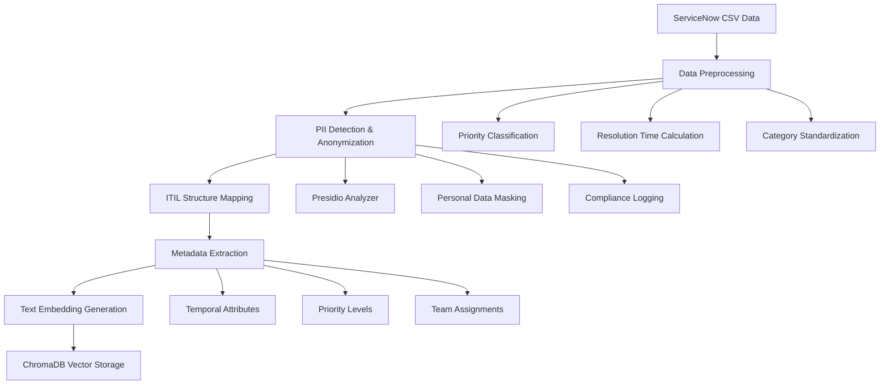
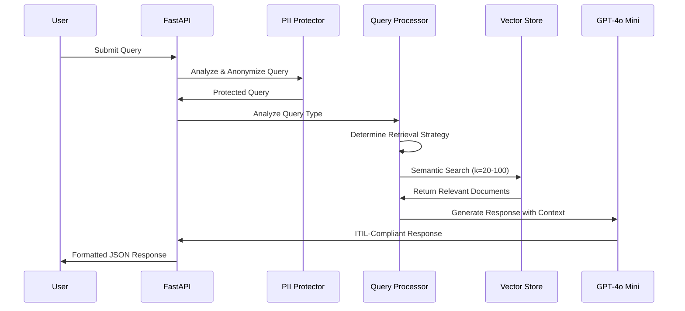

# Enterprise RAG IT Support Assistant

A sophisticated Retrieval-Augmented Generation (RAG) system designed for enterprise IT support operations, leveraging ServiceNow incident data to provide intelligent assistance with root cause analysis, incident patterns, and ITIL-compliant resolution guidance.

## 🏗️ Architecture Overview

This application implements a state-of-the-art RAG architecture combining semantic search, conversational AI, and enterprise-grade in- **Bullet Points**: For step-by-step procedures
- **Metrics**: Real-time token usage, cost, and performance data

## 🛡️ PII Protection & Data Privacy

This system includes enterprise-grade PII (Personally Identifiable Information) protection using **Microsoft Presidio**, ensuring compliance with GDPR, HIPAA, and other privacy regulations.

### Automatic PII Detection & Anonymization

The system automatically detects and anonymizes sensitive information in both incident data and user queries:

**Protected Data Types:**
- **Personal Names** (`John Doe` → `[PERSON]`)
- **Email Addresses** (`john.doe@company.com` → `[EMAIL]`)
- **Phone Numbers** (`555-123-4567` → `[PHONE]`)
- **Social Security Numbers** (`123-45-6789` → `[SSN]`)
- **Credit Card Numbers** (`4111-1111-1111-1111` → `[CREDIT_CARD]`)
- **IP Addresses** (`192.168.1.1` → `[IP_ADDRESS]`)
- **Physical Locations** (`123 Main St, Boston` → `[LOCATION]`)
- **Driver's License Numbers** → `[DRIVER_LICENSE]`

**Preserved Operational Data:**
- ✅ **Incident Numbers** (INC0012347, CHG0001234)
- ✅ **Categories & Subcategories** (Hardware, Network, Software)
- ✅ **Priority Levels** (Critical, High, Medium, Low)
- ✅ **Timestamps** (incident timelines for SLA tracking)
- ✅ **Team Assignments** (for operational analysis)

### Real-Time Protection

```
Original Query: "John Doe at john.doe@company.com reported login issues"
Protected Query: "[PERSON] at [EMAIL] reported login issues"
```

The system maintains semantic meaning while protecting privacy, ensuring accurate incident analysis without exposing personal data.

### Configuration & Compliance

**Compliance Logging:**
```
2025-07-30 19:58:25,650 - chatbot - INFO - PII detected in incident INC0012441: 1 entities of types ['PERSON']
```

**Customizable Settings** (`pii_config.py`):
```python
CONFIG = {
    "enabled": True,
    "excluded_entities": ["DATE_TIME"],  # Preserve incident timelines
    "min_confidence": 0.6,               # Detection sensitivity
    "log_pii_findings": True             # Compliance audit trail
}
```

### Enterprise Benefits

1. **Zero Trust Privacy**: Personal data never reaches OpenAI servers
2. **Audit Compliance**: Complete logging of PII detection and handling
3. **Operational Integrity**: Incident analysis remains accurate and complete
4. **Regulatory Compliance**: GDPR, HIPAA, SOX-ready data protection
5. **Performance Optimized**: Real-time protection with minimal latency impact

## � Additional Documentationnt management expertise.

```
┌─────────────────────────────────────────────────────────────────┐
│                     Enterprise RAG Architecture                 │
├─────────────────────────────────────────────────────────────────┤
│                                                                 │
│  ┌─────────────┐    ┌──────────────┐    ┌─────────────────┐    │
│  │   FastAPI   │    │   LangChain  │    │   OpenAI GPT    │    │
│  │  Web Layer  │◄──►│   RAG Chain  │◄──►│   4o Mini       │    │
│  └─────────────┘    └──────────────┘    └─────────────────┘    │
│         │                   │                       │          │
│         ▼                   ▼                       ▼          │
│  ┌─────────────┐    ┌──────────────┐    ┌─────────────────┐    │
│  │  HTML/JS    │    │   ChromaDB   │    │  OpenAI Embed   │    │
│  │  Frontend   │    │ Vector Store │    │   Text-Ada-002  │    │
│  └─────────────┘    └──────────────┘    └─────────────────┘    │
│         │                   │                       │          │
│         ▼                   ▼                       ▼          │
│  ┌─────────────┐    ┌──────────────┐    ┌─────────────────┐    │
│  │ Presidio PII│    │ ServiceNow   │    │  Data Pipeline  │    │
│  │ Protection  │◄──►│ Incident CSV │◄──►│  & Processing   │    │
│  └─────────────┘    └──────────────┘    └─────────────────┘    │
└─────────────────────────────────────────────────────────────────┘
```

## 🔄 RAG Process Flow

The RAG system follows a sophisticated multi-stage process for intelligent incident analysis:

### 1. Data Ingestion & Preprocessing



### 2. Query Processing & Retrieval



### 3. Intelligent Query Classification

The system automatically detects query types and optimizes retrieval accordingly:

| Query Type | Patterns | Documents Retrieved | Use Case |
|------------|----------|-------------------|----------|
| **Analytical** | `pattern`, `trend`, `how many`, `count` | k=50 | Statistical analysis, reporting |
| **Temporal** | `between`, `within`, `time frame` | k=100 | Time-based incident analysis |
| **Category** | `similar to`, `type of`, `like this` | k=25 | Incident classification queries |
| **Priority** | `critical`, `urgent`, `severity` | k=30 | Priority-based filtering |
| **Resolution** | `resolved`, `resolution time`, `duration` | k=40 | Performance metrics analysis |
| **Team** | `assigned to`, `team`, `group` | k=30 | Team performance analysis |

## 🚀 Getting Started

### Prerequisites

- Python 3.8+
- OpenAI API Key
- Git
- 4GB+ RAM (for vector storage)

### Installation Steps

1. **Clone the Repository**
   ```bash
   git clone https://github.com/samalrashmi/genai-it-support.git
   cd genai-it-support
   ```

2. **Create Virtual Environment**
   ```bash
   python -m venv venv
   
   # On Windows
   venv\Scripts\activate
   
   # On macOS/Linux
   source venv/bin/activate
   ```

3. **Install Dependencies**
   ```bash
   pip install -r requirements.txt
   ```

4. **Download spaCy Language Model (Required for PII Protection)**
   ```bash
   python -m spacy download en_core_web_sm
   ```

5. **Configure OpenAI API Key**
   
   Create `config.properties` file:
   ```ini
   [DEFAULT]
   apikey = your_openai_api_key_here
   ```

6. **Configure PII Protection (Optional)**
   
   The system includes enterprise-grade PII protection via Microsoft Presidio. 
   Customize `pii_config.py` for your organization's requirements:
   ```python
   # PII entities to detect and anonymize
   PII_ENTITIES = [
       "PERSON",           # Personal names
       "EMAIL_ADDRESS",    # Email addresses  
       "PHONE_NUMBER",     # Phone numbers
       "CREDIT_CARD",      # Credit card numbers
       "US_SSN",          # Social Security Numbers
       "IP_ADDRESS",       # IP addresses
       "LOCATION",         # Addresses, locations
       "US_DRIVER_LICENSE" # Driver's license numbers
   ]
   
   # Configuration
   CONFIG = {
       "enabled": True,
       "excluded_entities": ["DATE_TIME"],  # Preserve incident timelines
       "min_confidence": 0.6
   }
   ```

7. **Setup Logging Configuration**
   
   Create `logging.conf` file:
   ```ini
   [loggers]
   keys=root,chatbot

   [handlers]
   keys=consoleHandler,fileHandler

   [formatters]
   keys=simpleFormatter

   [logger_root]
   level=DEBUG
   handlers=consoleHandler

   [logger_chatbot]
   level=DEBUG
   handlers=consoleHandler,fileHandler
   qualname=chatbot
   propagate=0

   [handler_consoleHandler]
   class=StreamHandler
   level=INFO
   formatter=simpleFormatter
   args=(sys.stdout,)

   [handler_fileHandler]
   class=FileHandler
   level=DEBUG
   formatter=simpleFormatter
   args=('logs/chatbot.log',)

   [formatter_simpleFormatter]
   format=%(asctime)s - %(name)s - %(levelname)s - %(message)s
   ```

8. **Create HTML Template**
   
   Create `templates/chat.html`:
   ```html
   <!DOCTYPE html>
   <html>
   <head>
       <title>IT Support Assistant</title>
       <style>
           body { font-family: Arial, sans-serif; margin: 20px; }
           .chat-container { max-width: 800px; margin: 0 auto; }
           .message { margin: 10px 0; padding: 10px; border-radius: 5px; }
           .user { background-color: #e3f2fd; text-align: right; }
           .assistant { background-color: #f5f5f5; }
           .metrics { font-size: 0.8em; color: #666; margin-top: 5px; }
           input[type="text"] { width: 70%; padding: 10px; }
           button { padding: 10px 20px; }
       </style>
   </head>
   <body>
       <div class="chat-container">
           <h1>🔧 Enterprise IT Support Assistant</h1>
           <div id="chat-messages"></div>
           <div>
               <input type="text" id="message-input" placeholder="Ask about incidents, patterns, or troubleshooting...">
               <button onclick="sendMessage()">Send</button>
           </div>
       </div>
       
       <script>
           async function sendMessage() {
               const input = document.getElementById('message-input');
               const message = input.value.trim();
               if (!message) return;
               
               addMessage(message, 'user');
               input.value = '';
               
               try {
                   const response = await fetch('/chat', {
                       method: 'POST',
                       headers: {'Content-Type': 'application/json'},
                       body: JSON.stringify({message: message})
                   });
                   
                   const data = await response.json();
                   addMessage(data.response, 'assistant', data.metrics);
               } catch (error) {
                   addMessage('Error: ' + error.message, 'assistant');
               }
           }
           
           function addMessage(text, sender, metrics = null) {
               const container = document.getElementById('chat-messages');
               const div = document.createElement('div');
               div.className = `message ${sender}`;
               div.innerHTML = text;
               
               if (metrics) {
                   const metricsDiv = document.createElement('div');
                   metricsDiv.className = 'metrics';
                   metricsDiv.innerHTML = `
                       ⏱️ ${metrics.response_time} | 
                       🔢 ${metrics.total_tokens} tokens | 
                       💰 ${metrics.cost}
                   `;
                   div.appendChild(metricsDiv);
               }
               
               container.appendChild(div);
               container.scrollTop = container.scrollHeight;
           }
           
           document.getElementById('message-input').addEventListener('keypress', function(e) {
               if (e.key === 'Enter') sendMessage();
           });
       </script>
   </body>
   </html>
   ```

9. **Prepare Incident Data**
   
   Ensure your `Snow_Incidents.csv` file contains the following columns:
   ```
   Number, State, Category, Subcategory, Impact, Urgency, Priority, 
   Opened At, Resolved At, Assignment Group, Assigned To, 
   Short Description, Notes
   ```

### Running the Application

1. **Start the Server**
   ```bash
   uvicorn app:app --host 0.0.0.0 --port 8000 --reload
   ```

2. **Access the Application**
   - **Web Interface:** http://localhost:8000
   - **API Documentation:** http://localhost:8000/docs
   - **Chat Endpoint:** `POST http://localhost:8000/chat`
   - **PII Status:** `GET http://localhost:8000/pii-status`

### API Usage Examples

**Using cURL:**
```bash
# Analytical Query
curl -X POST "http://localhost:8000/chat" \
  -H "Content-Type: application/json" \
  -d '{"message": "How many incidents were resolved within 24 hours?"}'

# Pattern Analysis
curl -X POST "http://localhost:8000/chat" \
  -H "Content-Type: application/json" \
  -d '{"message": "What are the patterns in Critical priority Network incidents?"}'

# RCA Query
curl -X POST "http://localhost:8000/chat" \
  -H "Content-Type: application/json" \
  -d '{"message": "Show me the RCA for incident INC0012347"}'

# Check PII Protection Status
curl -X GET "http://localhost:8000/pii-status"

# Test PII Analysis (Development)
curl -X POST "http://localhost:8000/analyze-pii" \
  -H "Content-Type: application/json" \
  -d '{"text": "John Doe reported issue with email john.doe@company.com"}'
```

## 🔧 Technical Details

### Core Components

#### 1. Vector Store Implementation
```python
# ChromaDB with OpenAI Embeddings
embeddings = OpenAIEmbeddings()
vectorstore = Chroma(
    persist_directory='vectordb',
    embedding_function=embeddings
)
```

#### 2. Dynamic Query Processing
```python
# Intelligent retrieval based on query type
query_patterns = {
    'analytical': {'k': 50, 'patterns': ['pattern', 'trend', 'how many']},
    'temporal': {'k': 100, 'patterns': ['between', 'within', 'time frame']},
    'category': {'k': 25, 'patterns': ['similar to', 'type of']}
}
```

#### 3. ITIL-Compliant Response Generation
```python
# GPT-4o Mini with optimized prompting
llm = ChatOpenAI(
    model="gpt-4o-mini",
    temperature=0.7,
    max_tokens=4096
)
```

#### 4. Enterprise PII Protection
```python
# Microsoft Presidio integration
from presidio_analyzer import AnalyzerEngine
from presidio_anonymizer import AnonymizerEngine

# Anonymize sensitive data before processing
pii_protector = PIIProtector()
protected_text = pii_protector.anonymize_text(incident_text)
```

### Data Processing Pipeline

#### 1. Incident Text Preparation
Each incident is transformed into a structured format with PII protection:
```
=== Incident Details ===
Incident Number: INC0012347
Status: Resolved

=== Classification ===
Category: Hardware
Subcategory: Printer

=== Priority Assessment ===
Impact: Medium
Urgency: High
Priority: 2 - High
Overall Severity: High

=== Support Details ===
Assignment Group: Desktop Support
Assigned To: [PERSON]    # PII Protected

=== Description ===
Summary: Printer connectivity issue
Notes: User [PERSON] reported... # PII Protected
```

#### 2. Metadata Optimization
Optimized metadata structure for efficient querying:
```python
metadata = {
    'incident_id': 'INC0012347',
    'category': 'Hardware',
    'subcategory': 'Printer',
    'priority_level': '2',
    'severity': 'High',
    'state': 'Resolved',
    'team': 'Desktop Support',
    'timestamp': 1721970000.0,
    'year_month': '2025-07',
    'resolution_hours': 5.5
}
```

### Performance Optimizations

1. **Context Window Management**: 128k token capacity with GPT-4o Mini
2. **Dynamic Document Retrieval**: Adjusts k parameter based on query complexity
3. **Intelligent Caching**: ChromaDB persistence for fast startup
4. **Cost Optimization**: 98.5% cost reduction vs GPT-4 (~$0.003 per query)
5. **PII Protection**: Real-time data anonymization without performance impact

## 📊 System Capabilities

### Query Types Supported

1. **Root Cause Analysis (RCA)**
   - `"Show me the RCA for incident INC0012347"`
   - Provides structured analysis with impact, resolution steps, and prevention measures

2. **Pattern Analysis**
   - `"What are the patterns in Critical priority incidents?"`
   - Generates HTML tables with statistical breakdowns

3. **Temporal Analysis**
   - `"How many incidents were resolved within 24 hours between July 1-15?"`
   - Time-based filtering and trend analysis

4. **Category Analysis**
   - `"What incidents are similar to INC0012347?"`
   - Semantic similarity matching

5. **Performance Metrics**
   - `"What's the average resolution time for Hardware incidents?"`
   - SLA and performance reporting

### Response Formats

The system provides responses in multiple formats:

- **HTML Tables**: For analytical queries with structured data
- **ITIL Sections**: Root Cause, Impact, Resolution Steps, Prevention
- **Bullet Points**: For step-by-step procedures
- **Metrics**: Real-time token usage, cost, and performance data

## � Additional Documentation

- **[ARCHITECTURE.md](ARCHITECTURE.md)**: Detailed system architecture with Mermaid diagrams
- **[METADATA_PATTERNS.md](METADATA_PATTERNS.md)**: In-depth metadata chunking and query pattern analysis

## �🛠️ Development

### Project Structure
```
genai-it-support/
├── app.py                 # Main FastAPI application
├── requirements.txt       # Python dependencies
├── pii_config.py         # PII protection configuration
├── config.properties      # OpenAI API configuration
├── logging.conf          # Logging configuration
├── Snow_Incidents.csv    # Incident data
├── templates/
│   └── chat.html         # Web interface
├── vectordb/             # ChromaDB persistence
├── logs/                 # Application logs
└── README.md            # This file
```

### Key Dependencies
```txt
fastapi==0.104.1
uvicorn[standard]==0.24.0
langchain==0.0.350
langchain-openai==0.0.5
langchain-community==0.0.10
chromadb==0.4.18
pandas==2.1.4
openai==1.3.8
jinja2==3.1.2
python-multipart==0.0.6
# PII Protection
presidio-analyzer>=2.2.35
presidio-anonymizer>=2.2.35
spacy>=3.7.0
```

### Configuration Management

The application uses `config.properties` for environment-specific settings:
```ini
[DEFAULT]
apikey = your_openai_api_key_here

[DATABASE]
persist_directory = vectordb
chunk_size = 1000

[MODEL]
model_name = gpt-4o-mini
temperature = 0.7
max_tokens = 4096
```

## 🔍 Monitoring & Observability

### Logging Levels
- **INFO**: Query processing, performance metrics
- **DEBUG**: Detailed retrieval parameters, token usage
- **ERROR**: Exception handling and error recovery

### Performance Metrics
Real-time tracking of:
- Response time (typically 10-30 seconds)
- Token usage (input/output breakdown)
- Cost per query (~$0.003 average)
- Retrieved document count

### Health Checks
Monitor application health via:
```bash
curl http://localhost:8000/
```

## 🚀 Production Deployment

### Docker Deployment
```dockerfile
FROM python:3.11-slim

WORKDIR /app
COPY requirements.txt .
RUN pip install -r requirements.txt

COPY . .
EXPOSE 8000

CMD ["uvicorn", "app:app", "--host", "0.0.0.0", "--port", "8000"]
```

### Environment Variables
```bash
export OPENAI_API_KEY="your_api_key_here"
export ENVIRONMENT="production"
export LOG_LEVEL="INFO"
```

### Scaling Considerations
- **Vector Store**: ChromaDB handles 100k+ documents efficiently
- **Memory**: 4GB+ recommended for large incident datasets
- **CPU**: Multi-core beneficial for concurrent requests
- **Storage**: SSD recommended for vector database persistence

## 📈 Performance Benchmarks

| Metric | Value | Notes |
|--------|-------|-------|
| **Average Response Time** | 15-25 seconds | Complex analytical queries |
| **Token Efficiency** | 15k-17k tokens | Large context utilization |
| **Cost per Query** | $0.0026-0.0029 | GPT-4o Mini optimization |
| **Context Window** | 128k tokens | Handles large document sets |
| **Throughput** | 10-20 queries/min | Single instance capacity |

## 🔒 Security & Compliance

### Data Privacy & PII Protection
- **Microsoft Presidio Integration**: Enterprise-grade PII detection and anonymization
- **Configurable Protection**: Customizable entity detection (names, emails, phones, SSNs, etc.)
- **Incident Timeline Preservation**: Smart exclusion of operational dates/times
- **Compliance Logging**: Audit trail of PII detection and anonymization
- **Local Processing**: PII protection occurs before data leaves your environment

### Data Security
- Incident data processed locally
- Vector embeddings stored locally in ChromaDB
- No sensitive data transmitted to third parties (except anonymized context to OpenAI API)
- Configurable confidence thresholds for PII detection

### API Security
- Input validation and sanitization
- Error handling without data exposure
- Configurable logging levels

### Compliance Standards
- **GDPR Compliant**: Personal data anonymization and audit logging
- **HIPAA Ready**: Healthcare data protection capabilities
- **ITIL Aligned**: Standard incident categorization and resolution tracking
- **SOX Compatible**: Audit trail and data protection controls

## 🤝 Contributing

1. Fork the repository
2. Create a feature branch: `git checkout -b feature/new-capability`
3. Commit changes: `git commit -am 'Add new capability'`
4. Push to branch: `git push origin feature/new-capability`
5. Submit a Pull Request

## 📄 License

This project is licensed under the MIT License - see the LICENSE file for details.

## 🆘 Support

For technical support or questions:
1. Check the logs in `logs/chatbot.log`
2. Verify OpenAI API key configuration
3. Ensure incident data format matches expected schema
4. Submit issues via GitHub Issues

---

**Built with ❤️ for Enterprise IT Operations**

*Leveraging the power of RAG, LangChain, and OpenAI to revolutionize IT support intelligence.*